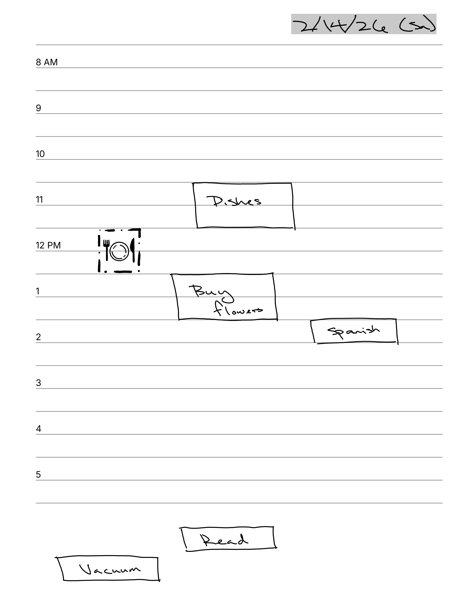

# Nighttime Planner
This nighttime planner covers 5 PM to 2 AM. Please see the `sample.png` in this folder for an example of how to use it.

## How to edit and use
The PDF file in the `ready-to-use` folder has been tested with the Manta.

If you want to tweak the HTML/CSS and use it for yourself, here are some steps that I used.

1. Once you're done tweaking it, open the HTML file in a browser and CTRL + P (Print). From the dropdown list of printers, there should be an option like "Save as PDF"

2. Remove the printing page margins

5. "Print" and it should download

And now you can move this PDF to your Mystyle folder and use it as a template!

