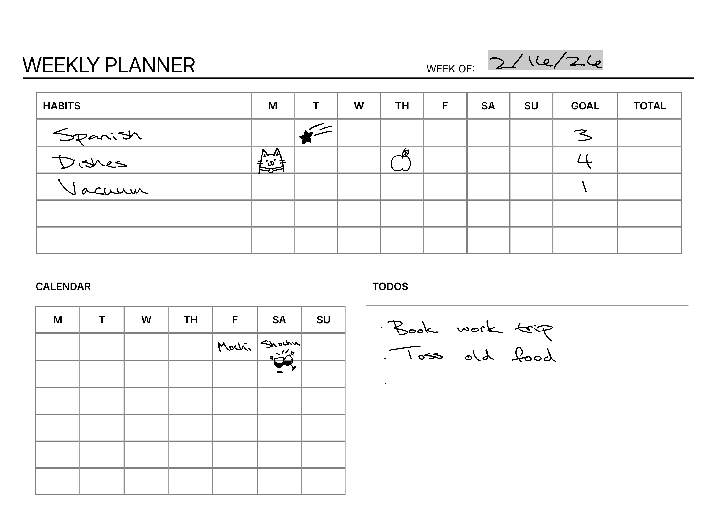

# Weekly Planner
This weekly planner features a habit tracker, quick overview of your calendar for the week, and a todo section. Please see the `sample.png` in this folder for example usage or use the templates in the `ready-to-use` folder, available in PDF or PNG.

## How to edit and use
The Weekly Planner PDF file in this folder has been tested with the Manta.

If you want to tweak the HTML/CSS and use it for yourself, here are some y steps that I used.

1. Once you're done tweaking it, open the HTML file in a browser and CTRL + P (Print). From the dropdown list of printers, there should be an option like "Save as PDF"

2. Choose the Landscape layout

3. Only print the first page

4. Remove the printing page margins

5. Rotate the PDF. I've been using [SmallPDF](https://smallpdf.com/rotate-pdf)

6. "Print" and it should download

And now you can move this PDF to your Mystyle folder and use it as a template!

